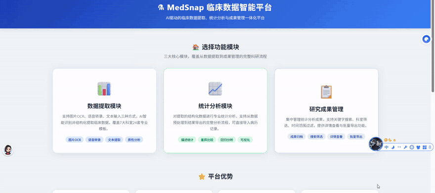
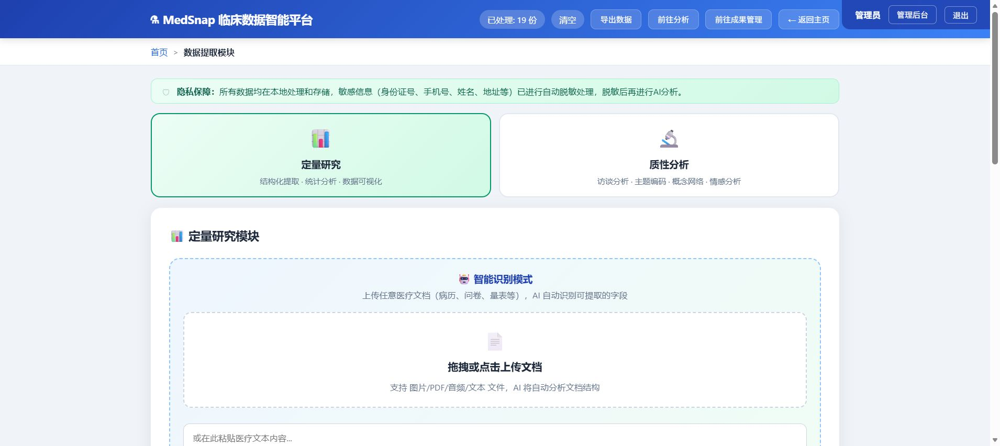
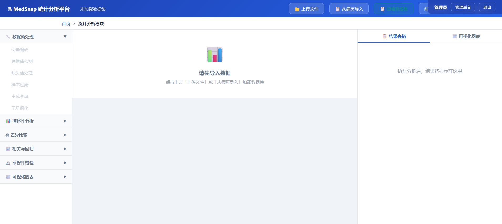
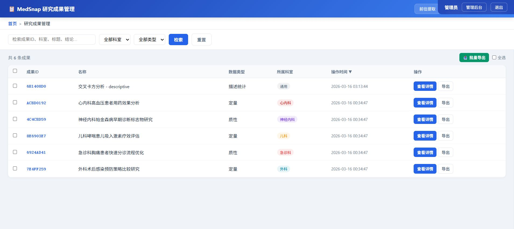
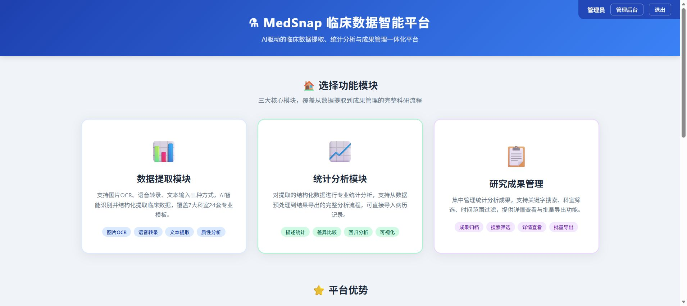
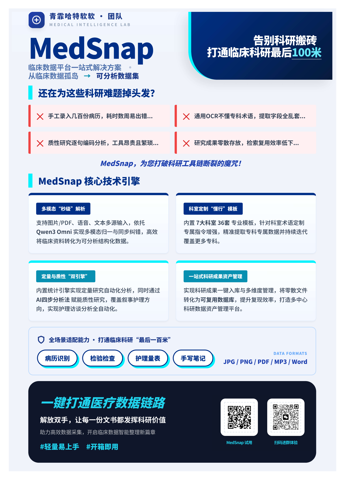

<div align="center">

# 🏥 MedSnap 医笺智识

### 告别科研搬砖，打通临床科研最后「100 米」

**AI 驱动的临床数据提取、统计分析与成果管理一体化平台**

[](https://www.python.org/)
[](https://flask.palletsprojects.com/)
[](https://www.alibabacloud.com/product/modelstudio)
[](LICENSE)

</div>

---

## 💡 为什么做 MedSnap？

临床医生想做科研时，最顺手的动作是**拿出手机拍病历**——但照片里的专业术语和关键数值，要变成可分析的结构化数据，只能靠手工一条条录入。几百份病历录下来，耗时数周，还极易出错。

| 😫 临床科研人的四大困境 | |
|---|---|
| **手工录入低效** | 几百份病历录入耗时数周，错误率高 |
| **通用 OCR 不懂行** | 「冠脉造影」被识别成「冠脉造形」，字段全乱套 |
| **分析工具链断裂** | 定量要来回切工具，质性要逐句人工编码 |
| **成果零散难复用** | 文件散落各处，同一数据反复采集 |

> **核心洞察**：临床科研的瓶颈从不是研究设计能力，而是**数据获取与预处理环节**。打通它，就能释放巨大的科研生产力。

## 🎬 产品演示

<div align="center">

</div>

*拍照上传 → AI 结构化提取 → 一键统计分析 → 学术三线表，全程不到一分钟。*

## 🚀 四大核心引擎

### 1️⃣ 多模态「秒级」解析
图片 / PDF / 语音 / 文本多源输入，依托 **Qwen3-Omni** 多模态大模型 + 医学上下文工程，懂专科术语、能纠正 OCR 错误，病历、检验单、问卷量表、手写笔记都能识别。

### 2️⃣ 科室定制「懂行」模板
内置 **7 大科室 36 套专业模板**，针对科室术语定制专属提取指令；支持自定义模板、字段预览与勾选提取，持续按用户反馈迭代。

### 3️⃣ 定量与质性「双引擎」
- **定量**：内置独立统计引擎（不依赖外部软件），一键生成描述统计、t 检验、方差分析、回归模型，直接输出**学术期刊格式三线表**与交互图表
- **质性**：AI 四步分析法（初始编码 → 主题聚类 → 代表性引用 → 层级化输出），覆盖医学访谈、叙事护理、焦点小组等热门研究类型

### 4️⃣ 一站式科研成果资产管理
分析成果一键入库，多维标签分类（疾病 / 方法 / 时间 / 科室），快速检索、批量导出，把零散文件变成可复用的科研数据库。

## 🖼️ 界面一览

| 数据提取（自动脱敏） | 统计分析平台 |
|---|---|
|  |  |

| 研究成果管理 | 主界面 |
|---|---|
|  |  |

> 🔒 **隐私保障**：所有数据本地处理和存储，敏感信息（身份证号、手机号、姓名、地址）**先自动脱敏，再进行 AI 分析**。

## 🛠️ 技术栈

- **后端**：Flask（蓝图模块化架构）+ SQLite
- **AI**：阿里云 DashScope · Qwen3-Omni 多模态大模型 + 医学上下文工程（缓解幻觉，提升专业度）
- **统计**：pandas / numpy / scipy 纯本地计算
- **部署**：Docker 一键部署，支持 ModelScope 创空间

<details>
<summary>📁 项目结构（点击展开）</summary>

```
MedSnap/
├── app.py                  # 入口：注册蓝图、启动服务（默认端口 7860）
├── config.py               # Flask 应用与 DashScope 配置
├── db_init.py              # SQLite 数据库初始化
├── prompts.py              # 各科室 / 场景的 AI 提取 Prompt 定义
├── desensitizer.py         # 敏感信息检测与本地脱敏
├── statistics_engine.py    # 统计分析引擎（纯计算，不依赖 Flask）
├── statistics_routes.py    # 统计分析路由
├── research_routes.py      # 科研成果管理路由
├── routes/                 # 蓝图：认证 / 模板 / 提取 / 记录 / 管理后台
├── services/               # AI 调用 / 文件处理 / 数据分析 / 导出
├── templates/  static/     # 页面与前端资源
└── 安装并启动.bat           # Windows 一键安装启动
```

</details>

## ⚡ 快速开始

```bash
pip install -r requirements.txt
export DASHSCOPE_API_KEY=你的Key    # Windows: set DASHSCOPE_API_KEY=你的Key
python app.py                       # 浏览器访问 http://localhost:7860
```

Windows 用户可直接双击 `安装并启动.bat`；也支持 `docker build -t medsnap .` 容器化部署。

## 🗺️ 路线图

- **短期**：完善重点科室字段上下文工程，建立多模态原生数据集，继续预训练（CPT）——让模型从「实习生」变「专家」
- **中长期**：引入 RL 技术，设计医学奖励函数——从「专家」进化为「有实践经验的专家」
- **终极愿景**：**一键洞察，全面掌握**——输入关键词（如「糖尿病」），专科数据跨科室整合、多中心汇聚，消除信息孤岛

---

<div align="center">

### 让每一份文书都发挥科研价值



</div>
